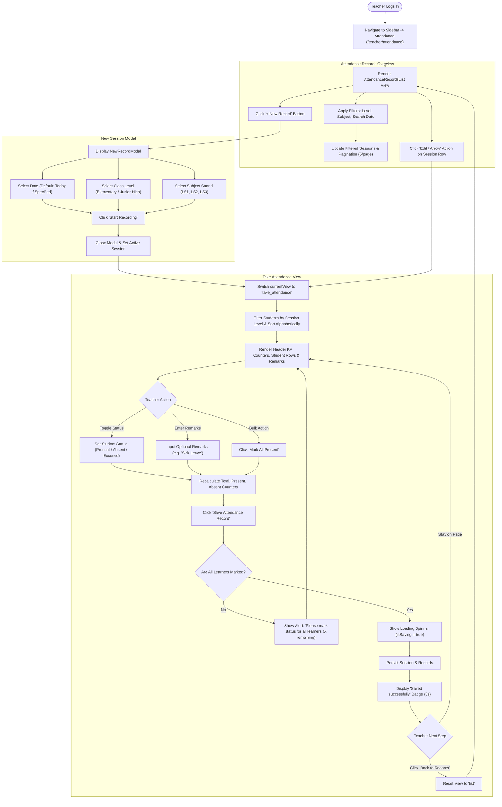
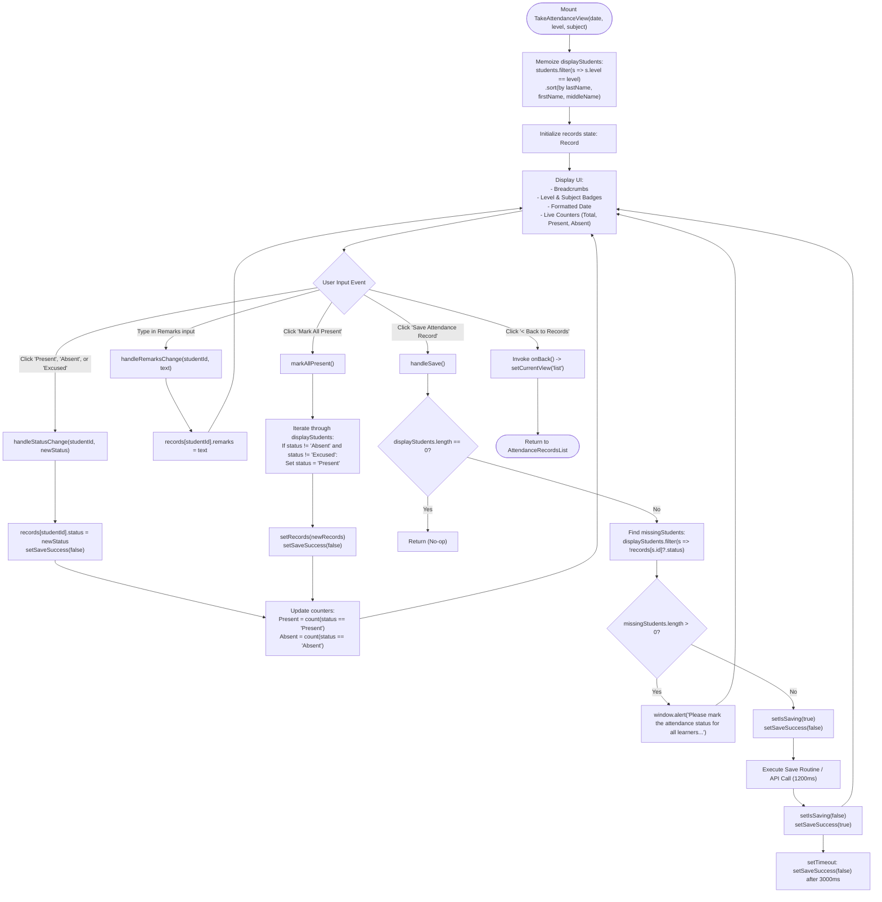
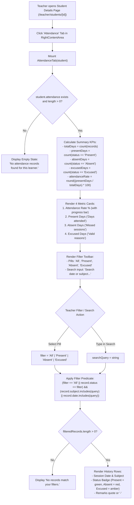
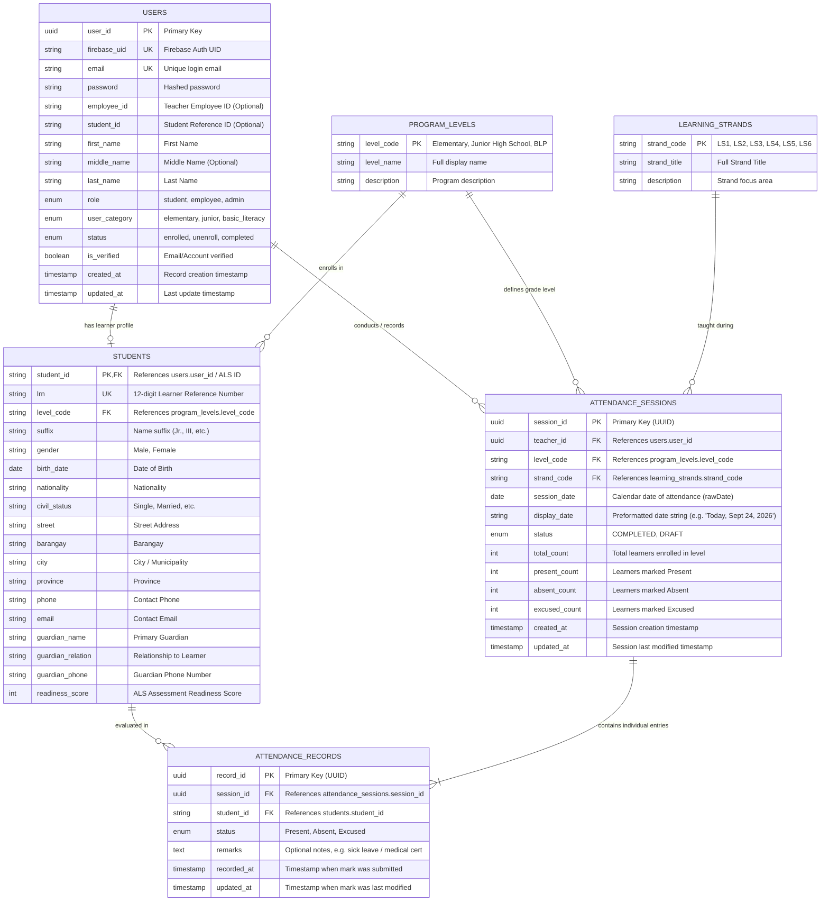

# Attendance System Specification: Flowcharts and Entity-Relationship Diagram (ERD)

This specification document details the complete architectural design, system workflows, and relational database schema for the **Attendance Feature** of the Alternative Learning System (ALS) platform, derived directly from the frontend implementation.

---

## 1. System Overview

The attendance system serves two core roles and user perspectives:
1. **Teacher Attendance Management (`/teacher/attendance`)**:
   - **Session Overview**: Paginated, filterable list of recorded class attendance sessions displaying date, level, subject strand, attendance rate, and session status (`COMPLETED` or `DRAFT`).
   - **New Session Modal**: Dialog to configure a new attendance session by selecting calendar date, class level (`Elementary` or `Junior High School`), and learning strand (`LS1`, `LS2`, `LS3`).
   - **Take Attendance View**: An interactive workspace filtering learners by class level, sorting them alphabetically, supporting per-student status selection (`Present`, `Absent`, `Excused`), remarks notes, "Mark All Present" bulk action, live metric counters, and status validation before saving.
2. **Learner-Level Attendance History (`/teacher/students/[id]` -> Attendance Tab)**:
   - Comprehensive historical log of all sessions attended by an individual learner.
   - Aggregate performance KPIs: Attendance Rate %, Total Present days, Total Absent days, and Excused days.
   - Multi-state status filter (`All`, `Present`, `Absent`, `Excused`) and search functionality.

---

## 2. Process Flowcharts

### 2.1 High-Level User Journey
The following flowchart illustrates the complete user workflow from logging in to viewing records, initiating new sessions, taking attendance, and saving records.

---

### 2.2 Take Attendance State Lifecycle & Validation
The following flowchart maps the exact reactive state transitions, bulk mutations, validation routines, and persistence triggers inside the attendance workspace.

---

### 2.3 Individual Learner Attendance History Flow (`AttendanceTab`)
The following flowchart illustrates how attendance history is aggregated, calculated, and filtered on the student profile page.

---

## 3. Entity-Relationship Diagram (ERD)

### 3.1 Visual Diagram (Mermaid)

---

### 3.2 Relational Entity Schema Specifications

#### Entity: `attendance_sessions`
- **Purpose**: Stores the master header for each class attendance session recorded by an ALS teacher.
- **Primary Key**: `session_id` (UUID)
- **Foreign Keys**:
  - `teacher_id` -> `users.user_id` (ON DELETE RESTRICT)
  - `level_code` -> `program_levels.level_code`
  - `strand_code` -> `learning_strands.strand_code`
- **Fields**:
  - `session_id`: UUID, Primary Key.
  - `teacher_id`: UUID, Foreign Key referencing the user who logged the session.
  - `level_code`: VARCHAR(50), e.g., `'Junior High School'`, `'Elementary'`, `'BLP'`.
  - `strand_code`: VARCHAR(50), e.g., `'LS1: Communication Skills'`, `'LS2: Scientific Literacy'`, `'LS3: Mathematical & Problem Solving'`.
  - `session_date`: DATE, The calendar date the session occurred (`YYYY-MM-DD`).
  - `display_date`: VARCHAR(100), Formatted date representation (e.g. `'Today, Sept 24, 2026'`).
  - `status`: VARCHAR(20), Enum: `'COMPLETED'` or `'DRAFT'`.
  - `total_count`: INTEGER, Cached number of learners belonging to the class level during this session.
  - `present_count`: INTEGER, Cached tally of learners marked `'Present'`.
  - `absent_count`: INTEGER, Cached tally of learners marked `'Absent'`.
  - `excused_count`: INTEGER, Cached tally of learners marked `'Excused'`.
  - `created_at`: TIMESTAMPTZ, Default `NOW()`.
  - `updated_at`: TIMESTAMPTZ, Nullable.
- **Constraints**:
  - `UNIQUE (teacher_id, session_date, level_code, strand_code)`: Prevents identical sessions recorded twice by the same instructor.

#### Entity: `attendance_records`
- **Purpose**: Contains granular per-student attendance results and observations for a session.
- **Primary Key**: `record_id` (UUID)
- **Foreign Keys**:
  - `session_id` -> `attendance_sessions.session_id` (ON DELETE CASCADE)
  - `student_id` -> `students.student_id` (ON DELETE CASCADE)
- **Fields**:
  - `record_id`: UUID, Primary Key.
  - `session_id`: UUID, References parent session.
  - `student_id`: VARCHAR(50), References learner identifier (e.g., `'ALS-0001'`).
  - `status`: VARCHAR(20), Enum: `'Present'`, `'Absent'`, or `'Excused'`.
  - `remarks`: TEXT, Nullable; notes such as reasons for absence or medical certificates.
  - `recorded_at`: TIMESTAMPTZ, Default `NOW()`.
  - `updated_at`: TIMESTAMPTZ, Nullable.
- **Constraints**:
  - `UNIQUE (session_id, student_id)`: A student can only have one recorded attendance status per session.

---

### 3.3 Frontend Mock Data to Backend Database Mapping

| Frontend Interface / Model | Property | Backend Table / Column | Type / Format |
| :--- | :--- | :--- | :--- |
| `AttendanceSession` (`mockTeacher.ts`) | `id` | `attendance_sessions.session_id` | UUID string |
| `AttendanceSession` | `rawDate` | `attendance_sessions.session_date` | `DATE` (`YYYY-MM-DD`) |
| `AttendanceSession` | `displayDate` | `attendance_sessions.display_date` | VARCHAR |
| `AttendanceSession` | `level` | `attendance_sessions.level_code` | VARCHAR |
| `AttendanceSession` | `subject` | `attendance_sessions.strand_code` | VARCHAR |
| `AttendanceSession` | `presentCount` | `attendance_sessions.present_count` | INTEGER |
| `AttendanceSession` | `totalCount` | `attendance_sessions.total_count` | INTEGER |
| `AttendanceSession` | `status` | `attendance_sessions.status` | VARCHAR (`COMPLETED`/`DRAFT`) |
| `AttendanceRecord` (`TakeAttendanceView.tsx`) | `status` | `attendance_records.status` | VARCHAR (`Present`/`Absent`/`Excused`) |
| `AttendanceRecord` | `remarks` | `attendance_records.remarks` | TEXT |
| `Student` (`mockStudents.ts`) | `id` / `lrn` | `students.student_id` / `students.lrn` | VARCHAR |
| `StudentAttendance` (`mockStudents.ts`) | `attendance[]` | Query join of `attendance_records` + `attendance_sessions` | Virtual representation |

---

## 4. Role-Based Access Control (RBAC) & Route Security

The attendance API enforces strict Role-Based Access Control to ensure data privacy and prevent unauthorized grading or manipulation.

### 4.1 Role Matrix & Endpoint Permissions

| Endpoint | HTTP Method | Allowed Roles | Restrictions & Behavior |
| :--- | :--- | :--- | :--- |
| `/api/v1/attendance/sessions` | `POST` | `EMPLOYEE` (Teacher), `ADMIN` | Takes/updates class attendance. **Students (`STUDENT`) are rejected with `403 Forbidden`.** |
| `/api/v1/attendance/sessions` | `GET` | `EMPLOYEE` (Teacher), `ADMIN` | Browses all class attendance sessions with filters. **Students (`STUDENT`) are rejected with `403 Forbidden`.** |
| `/api/v1/attendance/sessions/{session_id}` | `GET` | `EMPLOYEE` (Teacher), `ADMIN` | Views full session marks and remarks. **Students (`STUDENT`) are rejected with `403 Forbidden`.** |
| `/api/v1/attendance/students/{student_id}` | `GET` | `EMPLOYEE`, `ADMIN`, `STUDENT` (Self Only) | Teachers/Admins can view any student's logs. **Students can ONLY view their own records (`current_user.student_id == student_id`); other student records return `403 Forbidden`.** |
| All Endpoints | Any | None (Unauthenticated) | Missing or invalid token returns `401 Unauthorized`. |

### 4.2 Dependency Injection Pattern
FastAPI route protection is achieved using the project's centralized authentication dependencies from `app.features.auth.dependencies`:
- `require_teacher = require_roles(UserRole.EMPLOYEE, UserRole.ADMIN)`: Validates that the requesting token belongs to an active employee/admin and extracts their identity (`teacher_id`).
- `get_current_active_user`: Validates token claims and ensures the user account is active (`UserStatus.ENROLLED`).

